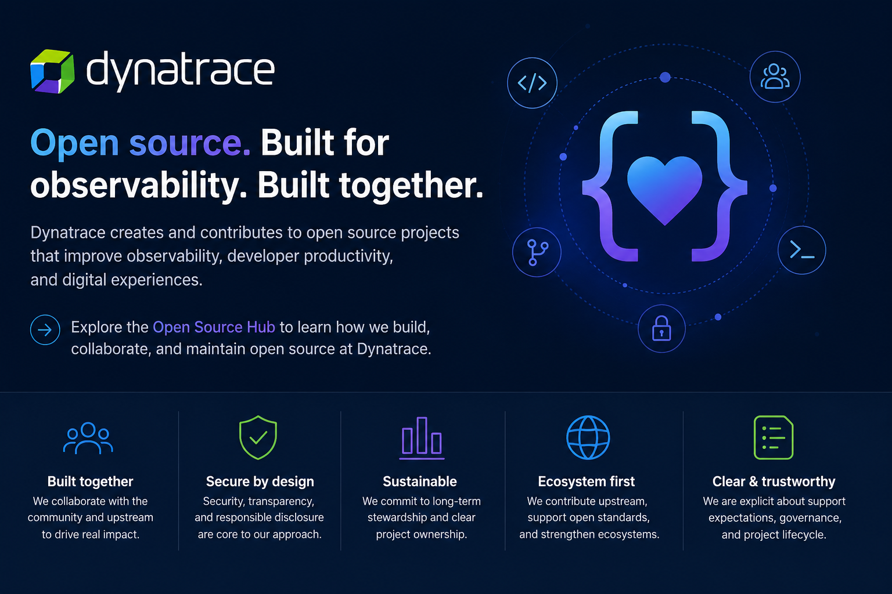
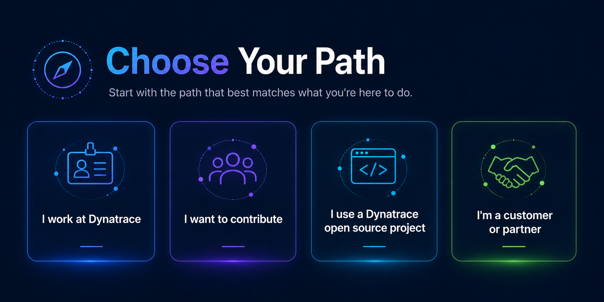
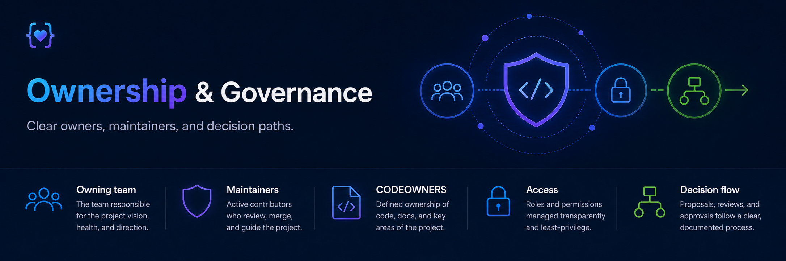

# Dynatrace Open Source Hub



Welcome to the **Dynatrace Open Source Hub** — the public home for guidance, standards, resources, and repository information that support how Dynatrace works in open source.

Dynatrace participates in open source as a contributor, maintainer, consumer, and ecosystem partner. This hub is designed to help Dynatrace employees, contributors, customers, and partners understand how to start, contribute to, maintain, and evolve public open source projects.

[Learn how Dynatrace approaches open source →](docs/getting-started/how-dynatrace-approaches-open-source.md)

---
## Choose your path


## Have an open source project idea?

Not sure whether your project should be open source, where it should live, or what support model applies?

Use the **Open Source Project Advisor** in Claude for a guided assessment.

The advisor can help you:

- Determine whether open source is the right approach.
- Evaluate whether the work belongs upstream.
- Recommend `Dynatrace`, `dynatrace-oss`, or another home.
- Determine the appropriate support model.
- Identify publication-readiness gaps.
- Prepare the information needed for a repository creation request.

**[Open the Open Source Project Advisor in Claude](https://claude.ai/project/01a015ec-48ad-7651-a086-d2f0da82112f)**

> The advisor provides guidance but does not approve or create repositories. Repository creation remains a governed process.

### I work at Dynatrace

Use this hub to understand how to:

- [Decide whether a project should be open source](docs/getting-started/should-this-be-open-source.md)
- [Determine where a repository belongs](docs/getting-started/where-does-my-repo-belong.md)
- [Create a new public repository](docs/publishing/new-repositories.md)
- [Publish an existing private repository](docs/publishing/private-to-public.md)
- [Complete the publishing checklist](docs/publishing/publishing-checklist.md)
- [Contribute to an external open source project](docs/contributing/employee-contributions.md)
- [Contribute upstream](docs/contributing/upstream-contributions.md)
- [Transfer a repository](docs/publishing/repository-transfers.md)
- [Archive a repository](docs/retiring/archive-policy.md)
- [Delete a repository](docs/retiring/deletion-policy.md)

### I want to contribute

Interested in contributing to a Dynatrace open source project?

Start here:

- [External contributor guidance](docs/contributing/external-contributors.md)
- [Understand project support models](docs/governance/support-models.md)
- [Explore the public repository inventory](inventory/)

Each repository may have its own contribution requirements, so always review its `README.md` and `CONTRIBUTING.md` before submitting changes.

### I use a Dynatrace open source project

Use this hub to:

- [Explore Dynatrace public repositories](inventory/)
- [Understand support models](docs/governance/support-models.md)
- [Understand repository lifecycle status](docs/governance/repository-lifecycle.md)
- [Review security readiness guidance](docs/maintaining/security-readiness.md)
- [Customer and partner guidance](docs/getting-started/customer-and-partner-guidance.md)

For security vulnerabilities, follow the reporting process provided by the Dynatrace organization-level security policy or a repository-specific `SECURITY.md`, where one exists.

---

## Repository lifecycle

A public repository should have a clear purpose, owner, support model, and lifecycle.

```text
Propose → Create → Prepare → Publish → Maintain → Review → Transfer / Archive
```

Repository status may evolve over time as project relevance, ownership, maintenance capacity, or ecosystem needs change.

[Learn more about the repository lifecycle →](docs/governance/repository-lifecycle.md)

---

## Public repository inventory

The Open Source Hub includes a structured inventory of public repositories across Dynatrace GitHub organizations.

The inventory helps track:

- Business and ecosystem purpose
- Strategic relevance
- Owning team
- Named maintainers
- Support model
- Activity level
- Documentation status
- License status
- Security readiness
- Dependencies and automation
- OpenSSF Scorecard signals
- Recommended lifecycle disposition

### Organizations

- [Dynatrace public repository inventory](inventory/dynatrace/)
- [dynatrace-oss public repository inventory](inventory/dynatrace-oss/)

[Explore the full inventory →](inventory/)

---

## Repository classifications

Public repositories may be classified using the following lifecycle categories:

| Classification | Purpose |
|---|---|
| **Strategic** | Projects with significant product, ecosystem, standards, or business relevance |
| **Active / Community-Supported** | Actively maintained projects without formal product support |
| **Experimental** | Early-stage projects, prototypes, or technical exploration |
| **Maintenance-Only** | Stable projects receiving limited updates rather than active feature development |
| **Archive Candidate** | Projects being evaluated for archival |
| **Transfer or Deletion Candidate** | Projects that may be better owned elsewhere or no longer warrant continued hosting |

Classification is a lifecycle and investment signal. It does not automatically determine whether a repository should be archived, transferred, or deleted.

---

## Guidance

### Getting started

- [Open source overview](docs/getting-started/overview.md)
- [Should this be open source?](docs/getting-started/should-this-be-open-source.md)
- [Where does my repository belong?](docs/getting-started/where-does-my-repo-belong.md)

### Governance

- [Repository lifecycle](docs/governance/repository-lifecycle.md)
- [Support models](docs/governance/support-models.md)
- [Contributor access](docs/governance/contributor-access.md)
- [Maintainer succession](docs/governance/maintainer-succession.md)

### Publishing

- [New repositories](docs/publishing/new-repositories.md)
- [Private-to-public transition](docs/publishing/private-to-public.md)
- [Publishing checklist](docs/publishing/publishing-checklist.md)

### Maintaining

- [Maintainer guide](docs/maintaining/maintainer-guide.md)
- [Repository health](docs/maintaining/repository-health.md)
- [Dependency management](docs/maintaining/dependency-management.md)
- [Security readiness](docs/maintaining/security-readiness.md)
- [OpenSSF Scorecard](docs/maintaining/openssf-scorecard.md)

### Contributing

- [Employee contributions](docs/contributing/employee-contributions.md)
- [External contributors](docs/contributing/external-contributors.md)
- [Upstream contributions](docs/contributing/upstream-contributions.md)

### Retiring repositories

- [Archive policy](docs/retiring/archive-policy.md)
- [Archive checklist](docs/retiring/archive-checklist.md)
- [Deletion policy](docs/retiring/deletion-policy.md)

### Support and security

- [Officially supported and community-supported projects](docs/governance/support-models.md)
- [Security readiness and vulnerability disclosure](docs/maintaining/security-readiness.md)

### Templates

- [Repository template guidance](docs/templates/repository-template.md)
- [README template](docs/templates/readme-template.md)
- [CONTRIBUTING template](docs/templates/contributing-template.md)
- [Support disclaimers](docs/templates/support-disclaimers.md)
- [Archive notice](docs/templates/archive-notice.md)

---

## Open source principles

Our approach is built around a few core expectations.

### Start with purpose

A repository should exist publicly for a clear product, ecosystem, community, or strategic reason.

### Make ownership visible

Every active project should have identifiable ownership and a sustainable maintainer model.

### Be explicit about support

Public availability does not automatically mean formal Dynatrace product support.

### Contribute upstream when it makes sense

We prefer strengthening shared upstream projects over maintaining unnecessary downstream divergence.

### Build for sustainability

Publishing a repository is not the end of the process. Public projects require ongoing maintenance, documentation, security review, ownership, and lifecycle decisions.

### Review instead of abandon

Inactive or low-activity repositories should be reviewed in context rather than automatically treated as obsolete.

---

## Open Source Team

The Dynatrace Open Source team helps establish and maintain the standards, processes, and governance that support our public open source ecosystem.

The team supports areas such as:

- Public repository governance
- Repository publishing and lifecycle guidance
- Open source contribution practices
- Repository health and sustainability
- Community and ecosystem engagement
- Strategic upstream participation
- Open source education and enablement

Individual repositories remain owned by the teams responsible for the projects themselves.

The Open Source team provides the framework, guidance, coordination, and governance that help those projects operate effectively in public.

---

## Who owns what?

### Project teams

Project teams are responsible for:

- Technical direction
- Day-to-day maintenance
- Pull request and issue review
- Releases
- Documentation
- Repository-specific support expectations
- Dependency management
- Responding to repository health concerns

### Open Source team

The Open Source team is responsible for:

- Public repository standards
- Repository lifecycle governance
- Publishing and transfer guidance
- Support model definitions
- Portfolio visibility
- Repository health frameworks
- Open source contribution guidance
- Cross-project coordination
- Open source ecosystem strategy

The goal is to make ownership clear while avoiding unnecessary centralization of project maintenance.

---

## Need help?

Have a question about:

- Creating or publishing a repository
- Moving a repository between organizations
- Repository lifecycle decisions
- Support models
- Open source contribution guidance
- Repository health
- Archival or deletion

[Open an open source request in Slack](https://dynatrace.enterprise.slack.com/archives/CJGELHH5E)
