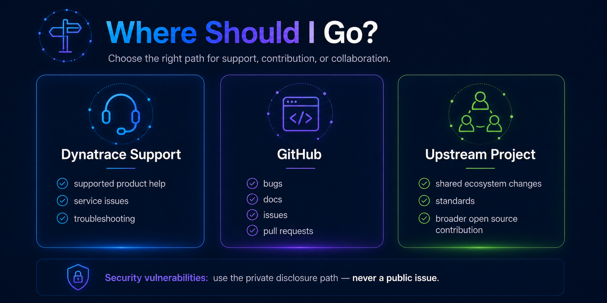

# Customer and Partner Guidance

Dynatrace customers and partners may interact with our open source projects as users, contributors, integrators, collaborators, or maintainers.

This guidance explains what to expect when working with Dynatrace public repositories and how to choose the right path for support, contribution, collaboration, or project ownership.

---

## Start with the repository

Each Dynatrace public repository may have different:

- Support expectations.
- Contribution processes.
- Maintainers.
- Release practices.
- Compatibility commitments.
- Community channels.
- Lifecycle status.

Before opening an issue or submitting a contribution, review the repository's:

- `README.md`
- `CONTRIBUTING.md`
- Support statement
- Security guidance
- Current project status

Public availability does not automatically mean that a project is formally supported by Dynatrace.

See [Support Models](../governance/support-models.md).

---

## Using a Dynatrace open source project

Customers and partners are welcome to use Dynatrace open source projects according to the license and documentation provided by each repository.

Before adopting a project, consider:

- Whether the project is officially supported, community-supported, experimental, or maintenance-only.
- Whether the project is actively maintained.
- Whether releases and compatibility expectations are documented.
- Whether the project is appropriate for production use.
- Whether your organization can manage any open source dependencies associated with the project.

Repository status may change over time, so lifecycle and support information should be reviewed periodically.

---

## Officially supported projects

Some open source projects are directly associated with officially supported Dynatrace products, services, integrations, SDKs, or distributions.

For these projects, the repository documentation should explain:

- What is officially supported.
- Which versions or components are covered.
- Where to obtain formal Dynatrace Support.
- What GitHub Issues should be used for.

If formal product support is needed, use the documented Dynatrace Support channel rather than assuming GitHub Issues are the appropriate support path.

See [Support Models](../governance/support-models.md).

---

## Community-supported projects

Community-supported projects are maintained openly but are not covered by formal Dynatrace product support unless explicitly stated.

For these projects:

- Issues and pull requests may be welcome.
- Maintainers may respond as capacity allows.
- Response or resolution times are not guaranteed.
- Development priorities may be influenced by maintainers and community contributors.
- Release schedules may be less predictable.

Community-supported does not mean abandoned.

A healthy community-supported project should still have visible ownership, contribution guidance, security reporting, and lifecycle information.

---

## Experimental projects

Experimental repositories may represent:

- Early technical exploration.
- Proofs of concept.
- Emerging integrations.
- Prototypes.
- Ecosystem experiments.

Experimental projects may change significantly, introduce breaking changes, or be discontinued.

Do not assume that experimental projects are appropriate for production environments unless the repository explicitly says otherwise.

---

## Contributing to Dynatrace projects

Customers and partners are welcome to contribute where a repository accepts external contributions.

Typical contributions include:

- Bug fixes.
- Documentation.
- Tests.
- Examples.
- Integrations.
- Feature proposals.
- Performance improvements.
- Compatibility improvements.

Before submitting a pull request:

1. Read the repository's `CONTRIBUTING.md`.
2. Search existing issues and pull requests.
3. Confirm that the contribution fits the project scope.
4. Open an issue or discussion first for significant changes where appropriate.
5. Follow repository-specific testing and documentation requirements.

See [External Contributors](../contributing/external-contributors.md).

---

## Proposing new functionality

If you need functionality that does not currently exist, consider whether the change:

- Belongs in the Dynatrace repository.
- Belongs in an upstream open source project.
- Is specific to your organization's environment.
- Could benefit the broader community.
- Requires product support or product roadmap consideration.

For substantial changes, discuss the proposal with maintainers before investing significant development effort.

A contribution being useful to one customer or partner does not automatically mean that it fits the long-term scope of the project.

---

## Upstream collaboration

Some Dynatrace repositories depend on or participate in broader open source ecosystems.

In these cases, maintainers may recommend contributing a change directly to the upstream project rather than implementing it only in a Dynatrace-owned repository.

This can help:

- Reduce duplicated maintenance.
- Improve interoperability.
- Benefit more users.
- Strengthen shared standards.
- Prevent long-term downstream divergence.

See [Upstream Contributions](../contributing/upstream-contributions.md).

---

## Customer-created open source projects

Customers may build applications, integrations, tools, examples, or other projects that interact with Dynatrace technology.

Dynatrace ownership is not automatically the right destination for a customer-created project.

Before proposing that Dynatrace host or maintain a customer-created project, consider:

- Who will maintain it long term.
- Whether Dynatrace is the appropriate project owner.
- Whether the project has broader ecosystem value.
- Whether the project should remain customer-owned.
- Whether another upstream community would be a better home.
- What support expectations users might infer from Dynatrace ownership.

Projects should not be transferred to Dynatrace solely to solve a maintenance or hosting problem.

---

## Partner-created projects

Partners may create integrations, tools, applications, examples, or extensions related to Dynatrace.

Partner-created projects should clearly communicate:

- Who owns the project.
- Who maintains it.
- Whether Dynatrace officially supports it.
- Whether the partner provides support.
- Where users should report issues.
- How security vulnerabilities should be disclosed.

Being compatible with Dynatrace does not automatically make a project a Dynatrace-supported project.

---

## Proposing a repository transfer to Dynatrace

In some cases, a customer or partner may believe an existing project would be better maintained within a Dynatrace GitHub organization.

A transfer may be considered when:

- The project has clear strategic or ecosystem value.
- Dynatrace is prepared to accept long-term ownership.
- An appropriate owning team exists.
- Maintainer responsibilities are clear.
- Licensing and intellectual property allow the transfer.
- Support expectations can be clearly defined.
- The transfer benefits users beyond the current organization.

Before a transfer is accepted, Dynatrace should review:

- Repository history.
- Licensing.
- Contributors.
- Dependencies.
- Security posture.
- Automation.
- Releases.
- Existing users.
- Current support expectations.
- Long-term maintenance requirements.

See [Repository Transfers](../publishing/repository-transfers.md).

---

## Joint projects and collaboration

Some customer or partner collaborations may be better structured as shared open source work rather than Dynatrace-owned projects.

Possible models include:

- Contribution to an existing Dynatrace project.
- Contribution to an upstream project.
- Partner-owned open source repository.
- Community-owned repository.
- Foundation-hosted project.
- Joint experimentation before deciding long-term ownership.

The preferred model should reflect where the project can receive the strongest and most sustainable stewardship.

---

## Support versus contribution


Support and contribution are different activities.

### Use support when

You need help with:

- A supported Dynatrace product.
- Product configuration.
- Troubleshooting.
- Service issues.
- Behavior covered by a formal Dynatrace support commitment.

Use the appropriate Dynatrace Support channel documented for the product.

### Use GitHub when

You want to:

- Report a repository-specific bug.
- Propose an enhancement.
- Improve documentation.
- Submit code.
- Discuss project development.
- Participate in an open source community.

The individual repository should explain which GitHub interactions are appropriate.

---

## Security vulnerabilities

Do not report suspected security vulnerabilities through:

- Public GitHub Issues.
- Pull requests.
- GitHub Discussions.
- Public community channels.

Follow the private reporting process defined by the Dynatrace organization-level security policy or repository-specific security guidance where applicable.

See [Security Readiness](../maintaining/security-readiness.md).

---

## Licensing and intellectual property

Before contributing code or transferring a project, confirm that you have the right to provide the material.

Do not submit:

- Proprietary code without authorization.
- Confidential information.
- Customer data.
- Credentials or secrets.
- Third-party material that cannot legally be contributed.
- Code copied from incompatible licensed sources.

Contributions are subject to the license and contribution terms documented by the repository.

---

## Access to Dynatrace repositories

External contributors generally do not need direct write access to contribute.

The normal contribution model is:

```text
Fork / Branch → Pull Request → Review → Merge
```

Direct repository access may be granted in limited cases where an established contributor has an ongoing maintainer role and elevated access is necessary.

See [Contributor Access](../governance/contributor-access.md).

---

## Project lifecycle changes

Open source projects evolve.

A project may move between:

- Active development.
- Community-supported maintenance.
- Maintenance-only status.
- Deprecation.
- Transfer.
- Archival.

Customers and partners should not assume that every repository will remain actively developed indefinitely.

Where possible, maintainers should communicate material lifecycle changes and provide migration or successor guidance.

See [Repository Lifecycle](../governance/repository-lifecycle.md).

---

## What Dynatrace asks from collaborators

Successful open source collaboration depends on shared responsibility.

We ask customers and partners to:

- Follow project contribution guidelines.
- Respect maintainer and upstream governance decisions.
- Report security issues privately.
- Avoid including confidential information in public repositories.
- Be clear about ownership and support expectations.
- Contribute changes upstream where appropriate.
- Consider long-term maintenance when proposing new projects.
- Participate constructively with maintainers and other contributors.

---

## What collaborators should expect from Dynatrace

Where Dynatrace maintains a public project, we aim to make it clear:

- Why the project exists.
- Who owns it.
- What support model applies.
- How to contribute.
- How to report vulnerabilities.
- What lifecycle status applies.
- Where users should go for help.

The level and speed of engagement may vary by support model and maintainer capacity.

---

## Need help?

If you are unsure whether your request belongs in:

- Dynatrace Support.
- A GitHub Issue.
- A contribution.
- An upstream project.
- A new open source project.
- A repository transfer or collaboration.

Start with the guidance in this hub or contact the Dynatrace Open Source team through the appropriate engagement channel.

---

## Related guidance

- [How Dynatrace Approaches Open Source](./how-dynatrace-approaches-open-source.md)
- [Where Does My Repository Belong?](./where-does-my-repo-belong.md)
- [Support Models](../governance/support-models.md)
- [External Contributors](../contributing/external-contributors.md)
- [Upstream Contributions](../contributing/upstream-contributions.md)
- [Contributor Access](../governance/contributor-access.md)
- [Repository Transfers](../publishing/repository-transfers.md)
- [Repository Lifecycle](../governance/repository-lifecycle.md)
- [Security Readiness](../maintaining/security-readiness.md)
