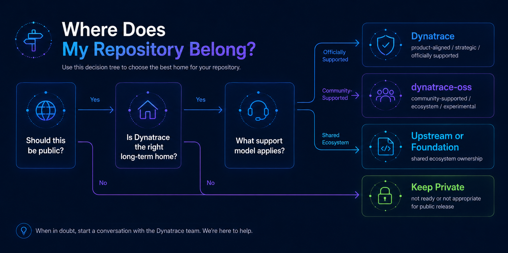

# Where Does My Repository Belong?

Choosing the correct repository location helps users understand who owns a project, how it is supported, and what relationship it has to Dynatrace.

Repository placement should be based on the project's **purpose, ownership, support model, and long-term role** rather than convenience or historical convention.
## Start with the most important question

### Is this repository intended to be public?

If no, use the appropriate internal Dynatrace repository environment and internal governance process.

If yes, continue below.

## Step 1: Is Dynatrace the right long-term home?

Before choosing a Dynatrace GitHub organization, ask whether Dynatrace should host the repository at all.

### Consider contributing upstream when

The work:

- Extends an existing open source project.
- Fixes a problem that affects the broader upstream community.
- Adds generally useful instrumentation, documentation, integrations, or examples.
- Would otherwise require Dynatrace to maintain a long-lived fork.
- Does not require Dynatrace-specific governance or release control.

When upstream contribution is practical, it is often preferable to creating a new Dynatrace-owned repository.

### A Dynatrace-owned repository may be appropriate when

The project:

- Is primarily developed or maintained by Dynatrace.
- Supports a Dynatrace capability or ecosystem strategy.
- Provides reusable tooling, SDKs, examples, integrations, or reference implementations.
- Needs a distinct release lifecycle.
- Has a clear owning team and maintainers.
- Has a sustainable reason to exist independently.

## Step 2: Determine the support model

Before deciding where the repository belongs, determine whether it is:

- Officially supported.
- Community-supported.
- Experimental.

See [Support Models](../governance/support-models.md).

Support status and repository organization are related, but they are **not the same thing**.

A repository's GitHub organization should never be used as the only signal of whether a project is officially supported.

The README must state the support model explicitly.

## Step 3: Choose the appropriate Dynatrace public organization

Dynatrace currently uses more than one public GitHub organization.

Repository placement should follow the approved governance model for those organizations.

### `Dynatrace`

This organization is generally appropriate for repositories with a strong relationship to official Dynatrace products, product delivery, supported SDKs, distributions, or strategically important technical assets.

A repository may belong here when it:

- Is part of an officially supported Dynatrace capability.
- Distributes or enables a supported Dynatrace product.
- Provides an official SDK or product integration.
- Is maintained as a strategic Dynatrace technical asset.
- Requires strong alignment with product or engineering ownership.

Before placing a repository here, confirm:

- Product or engineering owner.
- Support model.
- Maintainer commitment.
- Release responsibility.
- Security responsibility.

Do not place a project here simply because it was created by a Dynatrace employee.

### `dynatrace-oss`

This organization is generally appropriate for open source projects where Dynatrace participates as a maintainer or facilitator but standard product support may not apply.

A repository may belong here when it is:

- Community-supported.
- An ecosystem integration.
- Developer tooling.
- Customer or partner enablement.
- A public example or reference implementation.
- Experimental or incubating work.
- A project intended for broader external collaboration.
- A technical project that is related to Dynatrace but operates outside the normal product-support lifecycle.

Projects in this organization still require:

- Ownership.
- Maintainers.
- Security guidance.
- Licensing.
- Clear support expectations.

`dynatrace-oss` should not become a destination for projects simply because ownership or purpose is unclear.

## Step 4: Check for special cases

### Upstream forks

Avoid creating or maintaining long-lived forks unless there is a clear technical reason.

Before creating a fork, determine:

- Why the fork is required.
- What Dynatrace-specific changes will exist.
- Whether changes can be contributed upstream.
- How the fork will stay synchronized.
- Who owns maintenance.
- When the fork will be reviewed.

Marketplace, distribution, or automation forks should be periodically reviewed to determine whether they can be replaced by:

- Automated workflows.
- Temporary forks.
- Upstream contribution.
- External ownership.

### Demo and example repositories

A standalone repository may be appropriate when the demo or example:

- Has ongoing educational value.
- Is independently reusable.
- Has a clear owner.
- Requires its own development lifecycle.

Otherwise, consider placing the content in:

- An existing examples repository.
- Documentation.
- A learning repository.
- An upstream demo project.

Avoid creating permanent repositories for short-lived events unless continued maintenance is intentional.

### Customer-created projects

Customer-created projects should not automatically become officially supported Dynatrace repositories.

Before accepting or transferring a customer project, determine:

- Who owns the intellectual property.
- Who will maintain it.
- Where issues will be handled.
- Whether Dynatrace is assuming any support obligations.
- Whether transfer is necessary at all.

Community-supported hosting may be appropriate when there is a clear maintainer and user benefit.

### Partner-created projects

For partner projects, clarify:

- Repository ownership.
- Maintainer responsibilities.
- Branding.
- Support model.
- Release responsibility.
- Security handling.
- What happens if the partnership changes.

In many cases, the partner's organization may be the more sustainable home.

### Experiments and proofs of concept

Experiments may be published when there is value in working publicly.

They should have:

- An owner.
- A clear experimental disclaimer.
- A defined review date.
- No implication of production support.

An experiment should not become a permanent public repository simply because no one revisited it.

## Decision guide

Use the following questions in order.

### 1. Does an upstream project already exist?

**Yes:** Prefer upstream contribution where practical.

**No:** Continue.

### 2. Is Dynatrace prepared to own and maintain this project?

**No:** Do not create a Dynatrace public repository until ownership is resolved.

**Yes:** Continue.

### 3. Is it part of an officially supported product or distribution?

**Yes:** `Dynatrace` is likely the appropriate organization.

**No:** Continue.

### 4. Is it community-supported, ecosystem-oriented, enablement-focused, or experimental?

**Yes:** `dynatrace-oss` may be appropriate.

**No / unsure:** Request governance review.

### 5. Is this a fork?

**Yes:** Document why the fork is necessary and how it will be maintained before proceeding.

### 6. Could the content reasonably live in an existing repository?

**Yes:** Prefer the existing repository.

**No:** A new repository may be appropriate.

## Quick reference

| Repository type | Likely direction |
|---|---|
| Official product SDK | `Dynatrace` |
| Supported product distribution | `Dynatrace` |
| Strategic product-facing technical component | `Dynatrace` |
| Community-supported tool | `dynatrace-oss` |
| Developer utility | Often `dynatrace-oss` |
| Community integration | Often `dynatrace-oss` |
| Customer/partner community project | Case-by-case; often `dynatrace-oss` or external |
| Experiment / POC | `dynatrace-oss`, with expiration review |
| Improvement to existing external OSS | Prefer upstream |
| Marketplace/vendor catalog fork | Review before creating/retaining |
| Temporary event repository | Avoid unless continued value is expected |

This table is guidance, not an automatic placement rule.

## Before requesting a repository

Be prepared to provide:

- Proposed repository name.
- Project purpose.
- Intended audience.
- Owning team.
- Primary maintainer.
- Backup maintainer.
- Proposed support model.
- Proposed license.
- Relationship to Dynatrace products or ecosystems.
- Explanation of why an existing or upstream repository is not sufficient.
- Expected publication date.

When placement is unclear, request review **before** creating the repository.

The objective is not simply to choose between `Dynatrace` and `dynatrace-oss`. The objective is to choose a home that accurately reflects how the project will be owned, maintained, supported, and sustained.
