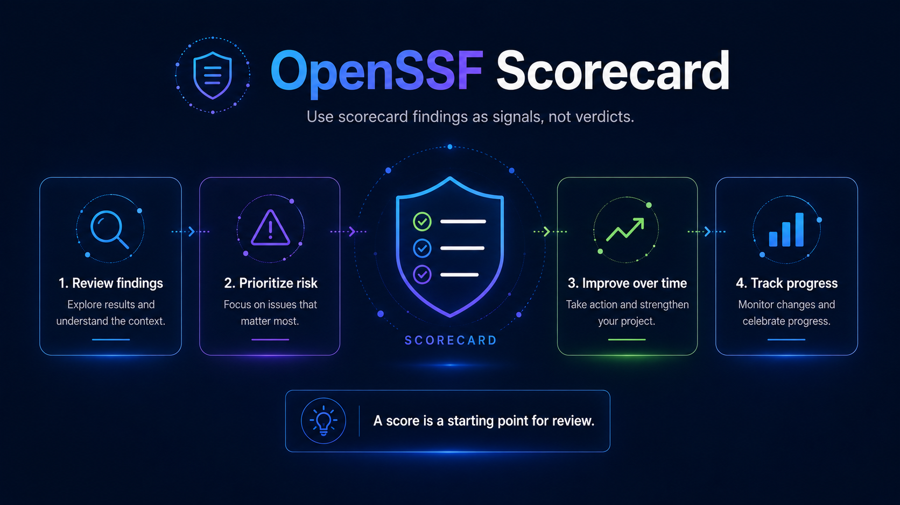

## OpenSSF Scorecard

[OpenSSF Scorecard](https://scorecard.dev/) provides automated checks that help identify software supply-chain security practices in open source repositories.

Dynatrace may use Scorecard results as one input when evaluating repository health and security readiness.

Scorecard results should be treated as **signals for investigation and improvement**, not as a standalone measure of repository quality or security.

## What Scorecard evaluates

OpenSSF Scorecard can evaluate areas such as:

- Branch protection.
- Code review practices.
- Dependency update tooling.
- Dangerous workflow patterns.
- Maintained status.
- Packaging practices.
- Pinned dependencies.
- Security policies.
- Signed releases.
- Token permissions.
- Vulnerability management.

Available checks may change as the Scorecard project evolves.

## Why Dynatrace uses Scorecard

Scorecard can help:

- Identify common supply-chain weaknesses.
- Establish a consistent security baseline.
- Compare repository configuration over time.
- Surface repositories requiring manual review.
- Prioritize improvements across a large public repository portfolio.

It is especially useful as part of repository inventory and lifecycle review.

## Scorecard is not a security certification

A high Scorecard result does not prove that a repository is secure.

A low result does not automatically mean a repository is unsafe.

Some checks may:

- Not apply to every project.
- Reflect deliberate repository design decisions.
- Require context that automation cannot determine.
- Be difficult to implement for technical reasons.

Maintainers should review individual findings rather than focusing only on the overall score.

## Recommended workflow

When reviewing a repository:

1. Retrieve the current Scorecard results.
2. Review individual checks.
3. Identify high-risk findings.
4. Determine which findings apply to the repository.
5. Document justified exceptions.
6. Prioritize practical improvements.
7. Re-run or review the Scorecard after changes.

## Priority findings

Pay particular attention to findings related to:

- Exposed or excessive token permissions.
- Unpinned GitHub Actions.
- Missing branch protection.
- Missing code review controls.
- Missing security policy.
- Dependency update gaps.
- Dangerous workflow configurations.
- Release security.
- Known vulnerabilities.

Not every failing check requires immediate remediation, but security-sensitive findings should not be ignored.

## Repository inventory

Where Scorecard data is collected as part of the Dynatrace public repository inventory, record at minimum:

| Field | Description |
|---|---|
| Repository | Repository name |
| Scorecard result | Current overall result where available |
| Scan date | Date results were retrieved |
| High-risk findings | Important findings requiring review |
| Status | Healthy / Review / Action required |
| Owner | Owning team |
| Follow-up | Required remediation or documented exception |

Avoid storing a Scorecard number without the date it was retrieved.

Results can change as repository configuration and Scorecard checks change.

## Scorecard and lifecycle decisions

Scorecard should inform lifecycle reviews but should not independently determine classification.

For example:

A strategic repository with security gaps may require increased investment rather than archival.

An abandoned repository with significant security findings may strengthen the case for archival or transfer.

An experimental repository may intentionally have fewer controls but should still avoid unnecessary security risks.

## Improving results

Common improvements may include:

- Adding `SECURITY.md`.
- Enabling dependency update tooling.
- Restricting workflow token permissions.
- Pinning third-party Actions.
- Requiring pull request review.
- Applying branch protections.
- Improving release processes.
- Enabling vulnerability scanning.

Changes should be appropriate to the repository rather than implemented solely to increase a numeric score.

## Exceptions

If a Scorecard recommendation is not appropriate:

- Document the reason.
- Confirm the risk is understood.
- Identify any compensating controls where applicable.
- Revisit the decision during future health reviews.

## Review cadence

Scorecard results should be refreshed periodically for active repositories and during major lifecycle reviews.

Consider reviewing Scorecard results:

- Before publication.
- During periodic repository health reviews.
- Before significant releases.
- After major repository configuration changes.
- When ownership changes.
- When evaluating archive, transfer, or maintenance-only status.

## Related guidance

- [Repository Health](./repository-health.md)
- [Security Readiness](./security-readiness.md)
- [Dependency Management](./dependency-management.md)
- [Maintainer Guide](./maintainer-guide.md)
