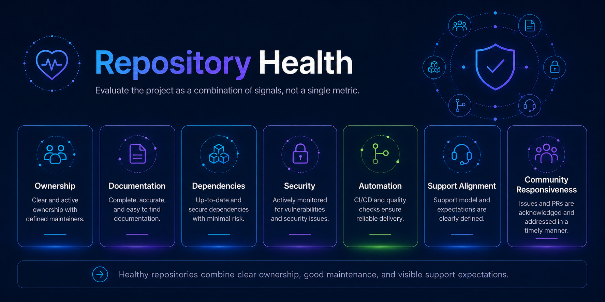

# Repository Health

Repository health is the ongoing condition of a project's ownership, maintenance, security, documentation, automation, and community activity.

Repository health should be evaluated as a combination of signals rather than a single activity metric.

A repository can be healthy with relatively few commits if it is stable, intentionally maintained, and meeting user needs.

## Health dimensions

Repository health should consider:

1. Ownership.
2. Activity.
3. Community responsiveness.
4. Documentation.
5. Security.
6. Dependencies.
7. Automation.
8. Support model.
9. Strategic or ecosystem relevance.
10. Lifecycle status.

## Ownership health

Healthy repositories should have:

- A known owning team.
- Active maintainers.
- Current `CODEOWNERS`.
- A backup maintainer or succession path.

Warning signs include:

- No identifiable owner.
- Maintainers who have left the team.
- Access controlled primarily by individuals.
- Pull requests waiting indefinitely for approval.

## Activity

Activity signals may include:

- Recent commits.
- Recent releases.
- Issue activity.
- Pull request activity.
- Contributor activity.
- Dependency updates.

Activity should be interpreted in context.

A mature library may require few changes while still being healthy.

Inactivity alone should not automatically trigger archival.

As a general operational signal, an extended period such as approximately 12 months without meaningful repository activity should trigger lifecycle review.

## Community responsiveness

Review:

- Unanswered issues.
- Unreviewed pull requests.
- Contributor questions.
- Time to first maintainer response.
- Repeated support requests.

Response expectations should align with the repository's documented support model.

Community-supported repositories may have slower response times than officially supported repositories, but they should not be represented as actively maintained if no maintainer capacity exists.

## Documentation health

Review whether the repository clearly explains:

- What the project does.
- Who it is for.
- How to install or use it.
- How to contribute.
- How to report security issues.
- The project's support model.
- The project's license.
- Current project status.

Check for:

- Broken links.
- Outdated screenshots.
- Obsolete commands.
- Unsupported versions.
- References to retired services or teams.

## Security health

Review:

- Security policy.
- Vulnerability reporting process.
- Dependency alerts.
- Secret scanning.
- Branch protection.
- Workflow permissions.
- Security scanning.
- OpenSSF Scorecard findings where applicable.

See [Security Readiness](./security-readiness.md).

## Dependency health

Review:

- Outdated dependencies.
- Unsupported dependencies.
- Known vulnerabilities.
- Dependency update automation.
- Unnecessary dependencies.
- Abandoned upstream projects.

See [Dependency Management](./dependency-management.md).

## Automation health

Check whether:

- CI is passing.
- Workflows still run.
- Scheduled jobs are succeeding.
- Release automation works.
- Dependency automation is active.
- Documentation validation works.
- Required checks are still relevant.

Broken automation should either be repaired or removed.

## Support alignment

Confirm that actual maintainer behavior matches the documented support model.

For example:

An officially supported repository should not operate like an abandoned community project.

A community-supported repository should not imply formal Dynatrace Support coverage unless that coverage actually exists.

See [Support Models](../governance/support-models.md).

## Strategic relevance

Consider whether the repository still supports:

- Dynatrace products.
- OpenTelemetry.
- Strategic ecosystem integrations.
- Customer or partner enablement.
- Developer workflows.
- Open source community participation.
- Standards or upstream projects important to Dynatrace.

Low strategic relevance does not automatically mean archival, but it should influence investment decisions.

## Suggested health review

For each repository, record:

| Area | Status | Notes |
|---|---|---|
| Ownership | Healthy / Review / Critical | |
| Maintainer activity | Healthy / Review / Critical | |
| Documentation | Healthy / Review / Critical | |
| Security | Healthy / Review / Critical | |
| Dependencies | Healthy / Review / Critical | |
| Automation | Healthy / Review / Critical | |
| Community responsiveness | Healthy / Review / Critical | |
| Support alignment | Healthy / Review / Critical | |
| Strategic relevance | High / Medium / Low | |
| Lifecycle recommendation | | |

## Possible lifecycle outcomes

A health review may result in:

- Continue active maintenance.
- Increase investment.
- Correct documentation or security gaps.
- Find additional maintainers.
- Move to community-supported.
- Move to maintenance-only.
- Transfer ownership.
- Deprecate.
- Archive.
- Delete in limited circumstances.

## Repository health is not a score alone

Automated metrics are useful signals but should not replace maintainer judgment.

For example:

- Commit frequency does not prove project value.
- Stars do not prove maintainability.
- OpenSSF Scorecard results do not determine support status.
- Low issue volume does not mean a repository is abandoned.

Health reviews should combine quantitative signals with ownership and project context.

## Related guidance

- [Maintainer Guide](./maintainer-guide.md)
- [Dependency Management](./dependency-management.md)
- [Security Readiness](./security-readiness.md)
- [OpenSSF Scorecard](./openssf-scorecard.md)
- [Repository Lifecycle](../governance/repository-lifecycle.md)
