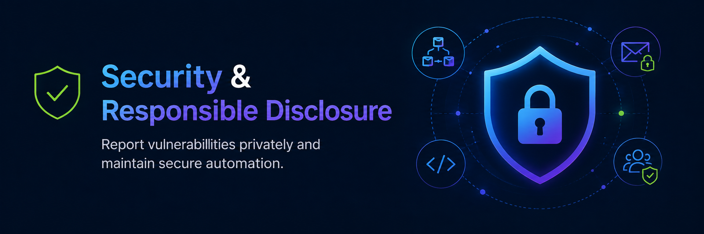

## Security policy

Dynatrace provides a centralized `SECURITY.md` at the organization `.github` level for public repositories.

Repositories should rely on the organization-level security policy unless they require repository-specific security guidance.

A repository-specific `SECURITY.md` may be appropriate when the project needs to document:

- Different supported versions.
- A project-specific vulnerability reporting process.
- Additional security contacts.
- Repository-specific disclosure expectations.
- Security considerations that are not covered by the organization-level policy.

Repository-specific security guidance should not conflict with the organization-level policy.

## Ownership

Security responsibilities must have a clear owner.

Maintainers should know:

- Who receives vulnerability reports.
- Who evaluates severity.
- Who coordinates remediation.
- Who manages disclosure.
- Who should be contacted when the owning team cannot resolve an issue.

## Secrets

Repositories must not contain:

- API keys.
- Passwords.
- Private certificates.
- Authentication tokens.
- Production credentials.
- Private customer information.

Secret scanning should be enabled where available.

If a secret is exposed:

1. Revoke or rotate it immediately.
2. Follow applicable incident-response procedures.
3. Remove it from the repository where appropriate.
4. Do not assume deleting the file removes the exposure.

## Branch protection

Important branches should use appropriate protections or repository rulesets.

Depending on the repository, these may include:

- Pull request review.
- Required status checks.
- Restricted force pushes.
- Restricted branch deletion.
- Signed commits where justified.
- CODEOWNERS review.

Controls should reflect the project's risk rather than being added solely for compliance.

## Security disclosures

Security vulnerabilities should be reported through the private disclosure process defined by the Dynatrace organization-level `SECURITY.md`.

Do not report suspected vulnerabilities through:

- Public GitHub Issues.
- Pull requests.
- GitHub Discussions.
- Other public repository channels.

Repositories should rely on the organization-level security policy unless project-specific security guidance is required.

A repository-specific `SECURITY.md` may be added when a project needs to document:

- Supported versions.
- Project-specific reporting instructions.
- Additional security contacts.
- Repository-specific disclosure expectations.

Repository-specific guidance must not conflict with the organization-level security policy.

## GitHub Actions

Review workflow permissions.

Use least privilege for `GITHUB_TOKEN` and other credentials.

Avoid unnecessary:

```yaml
permissions: write-all
