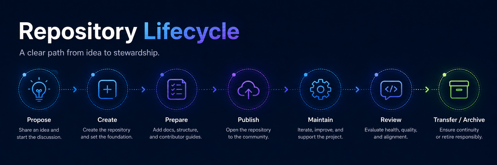
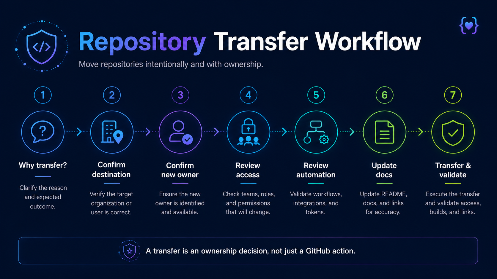

# Repository Transfers


Repository transfers move an existing repository from one GitHub organization or owner to another.

A transfer should be treated as a lifecycle and ownership decision, not simply an administrative GitHub action.

Before transferring a public repository, confirm that the destination organization is appropriate for the project, ownership is clear, support expectations are understood, and the transfer will not create unnecessary disruption for users, contributors, automation, or downstream dependencies.

---

## When a transfer may be appropriate

A repository may need to be transferred when:

- Its current GitHub organization no longer reflects the repository's purpose.
- Ownership has moved to another Dynatrace team.
- A community-supported project is moving between Dynatrace public organizations.
- A project should be governed by an upstream organization or foundation.
- A repository was created in the wrong organization.
- A project has matured from experimentation into a more strategic or officially supported asset.
- Long-term stewardship would be stronger under another organization or project owner.

A transfer should not be used simply to avoid resolving unclear ownership or maintenance responsibilities.

---

## Before requesting a transfer

Confirm the following.

### Repository purpose

Document:

- What the repository does.
- Who uses it.
- Why the transfer is needed.
- Whether the project is still actively maintained.
- Whether the destination organization is the appropriate long-term home.

If the repository's future is unclear, complete a lifecycle review before transferring it.

See [Repository Lifecycle](../governance/repository-lifecycle.md).

### Ownership

Confirm:

- Current owning team.
- Destination owning team.
- Current maintainers.
- Maintainers after the transfer.
- Required administrator access.
- Required `CODEOWNERS` updates.

The receiving team should explicitly understand the maintenance responsibilities associated with the repository.

A transfer should not create an ownerless repository.

### Support model

Confirm the repository's support model before and after the transfer.

Possible support models include:

- Officially supported.
- Community-supported.
- Experimental.
- Maintenance-only.

Moving a repository between organizations does **not** automatically change its support model.

Update repository documentation if support expectations change as part of the transfer.

See [Support Models](../governance/support-models.md).

---

## Choosing the destination organization

The destination should be based on the repository's purpose, ownership, support model, and long-term role.

For Dynatrace public repositories, review:

[Where Does My Repository Belong?](../getting-started/where-does-my-repo-belong.md)

Do not use organization placement alone to communicate whether a project is officially supported.

Support expectations should always be explicitly documented.

---

## Pre-transfer review

Before transferring the repository, review the following areas.

### Repository settings

Review:

- Repository visibility.
- Default branch.
- Branch protections or rulesets.
- Repository topics.
- Repository description.
- Features such as Issues, Discussions, Projects, and Wikis.
- GitHub Pages configuration.
- Merge settings.
- Repository templates.

Confirm that required settings will remain appropriate after the transfer.

### Access and permissions

Review:

- Administrators.
- Maintainers.
- Write access.
- External collaborators.
- GitHub teams.
- Deploy keys.
- GitHub Apps.
- Machine accounts.

Organization teams generally do not transfer with a repository in the same way repository content does.

Plan access in the destination organization before the transfer.

After the transfer, verify that required teams and maintainers have the correct permissions.

---

## CODEOWNERS

Review `.github/CODEOWNERS` or the repository's existing `CODEOWNERS` file before transfer.

Update entries that reference:

- Teams in the source organization.
- Individuals who will no longer maintain the project.
- Groups that do not exist in the destination organization.

Prefer team-based ownership where practical.

---

## GitHub Actions and automation

Repository transfers can affect automation.

Review:

- GitHub Actions.
- Workflow permissions.
- Organization-level Actions policies.
- Reusable workflows.
- Repository secrets.
- Environment secrets.
- Organization secrets.
- Variables.
- GitHub Apps.
- Webhooks.
- Scheduled workflows.

Pay particular attention to references containing the repository's old organization or repository path.

Examples may include:

```text
Dynatrace/example-repository
