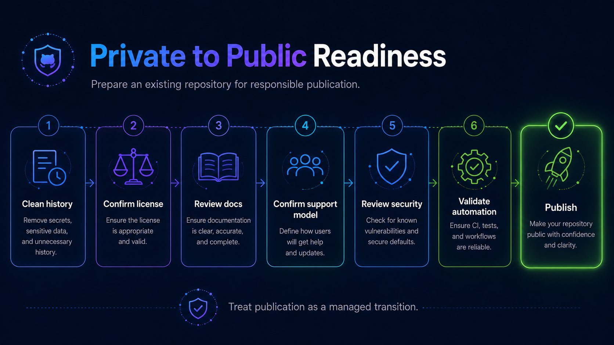

# Private-to-Public Transition

Changing an existing repository from private to public requires a publication readiness review.

The review must consider the entire repository history, not only the current branch.

## 1. Confirm purpose and ownership

Verify:

- The repository still has a valid reason to be public.
- The owning team is identified.
- Maintainers are identified.
- Support model is defined.
- Repository location is appropriate.

## 2. Review Git history

Inspect the complete history for:

- Credentials.
- API tokens.
- Certificates.
- Private keys.
- Customer information.
- Employee personal information.
- Confidential information.
- Internal hostnames.
- Internal URLs.
- Private infrastructure details.
- Proprietary assets.

Deleting sensitive information from the current branch does not remove it from Git history.

If sensitive data was committed, follow the appropriate security remediation process before publication.

## 3. Review intellectual property

Confirm that Dynatrace has the right to publish:

- Source code.
- Documentation.
- Images.
- Examples.
- Data.
- Third-party libraries.
- Copied code.
- Generated assets.

Verify dependency and license compatibility.

## 4. Review documentation

Ensure that users can understand:

- What the project does.
- Who it is intended for.
- How to install or use it.
- Its support model.
- Whether it is production-ready.
- How to contribute.
- How to report vulnerabilities.
- Known limitations.

## 5. Review repository configuration

Verify:

- CODEOWNERS.
- Repository access.
- Branch protections/rulesets.
- Security settings.
- GitHub Actions permissions.
- Dependency update configuration.
- Release automation.
- Webhooks and integrations.

## 6. Review GitHub Actions

Pay particular attention to workflows created while the repository was private.

Private repository workflows may assume:

- Broad token permissions.
- Trusted contributors.
- Access to internal systems.
- Private secrets.
- Internal runners.

Those assumptions may become unsafe once pull requests can originate externally.

## 7. Complete publication review

Complete the:

[Publishing Checklist](publishing-checklist.md)

Do not change repository visibility until required remediation is complete.
