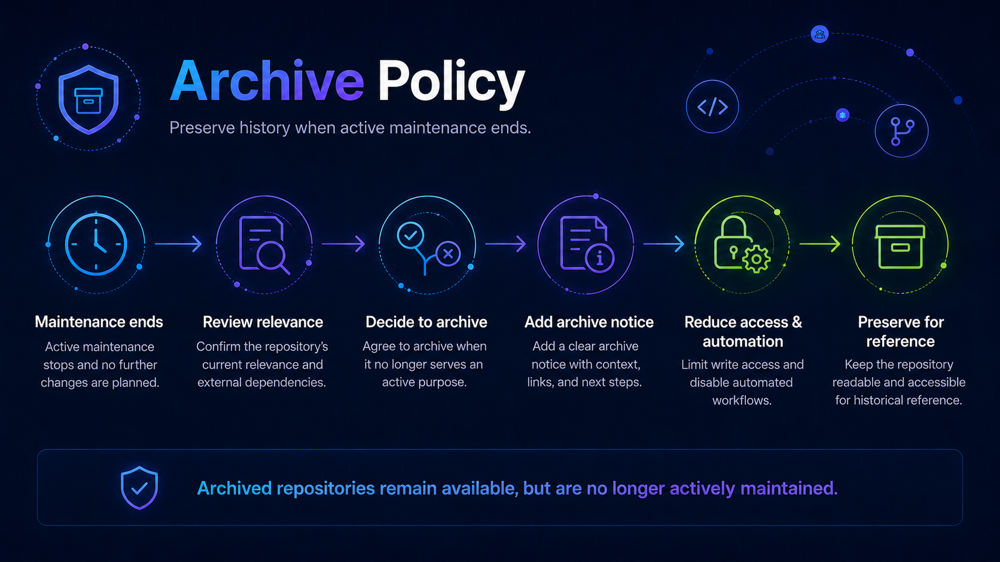

# Repository Archive Policy

Repositories should be archived when they are no longer actively maintained but their history remains useful.

Archiving is generally preferred over deletion when a repository has:

- Users.
- Contributors.
- Forks.
- Releases.
- Historical value.
- Documentation links.
- A meaningful development history.

## Archive review triggers

Review a repository for potential archival when:

- No meaningful activity has occurred for approximately 12 months.
- No active maintainers remain.
- The related product or capability has been retired.
- Another repository has replaced it.
- Work has moved upstream.
- An experiment has ended.
- The underlying technology is obsolete.
- Maintaining the project no longer provides sufficient value.

Inactivity alone does not require archival.

## Before archiving

Confirm:

- Owning team.
- Current maintainers.
- Known users.
- Product dependencies.
- Open issues.
- Open pull requests.
- Releases.
- Packages.
- Automation.
- External links.

## Communicate status

Add an archive notice to the top of the README.

Recommended language:

> **Archived**
>
> This project is no longer actively maintained. The repository remains available for reference. No additional features, fixes, or support should be expected.

If there is a replacement:

> Development has moved to [replacement project]. Users should migrate to the replacement where possible.

## Clean up infrastructure

Before archiving:

- Remove unnecessary secrets.
- Disable unnecessary workflows.
- Remove or update webhooks.
- Review GitHub Apps.
- Stop release automation.
- Review package publishing.
- Update external documentation.

## Archive the repository

GitHub's repository archive feature should be enabled only after final repository changes are complete.

## Record the decision

Record:

- Archive date.
- Reason.
- Former owning team.
- Replacement project where applicable.
