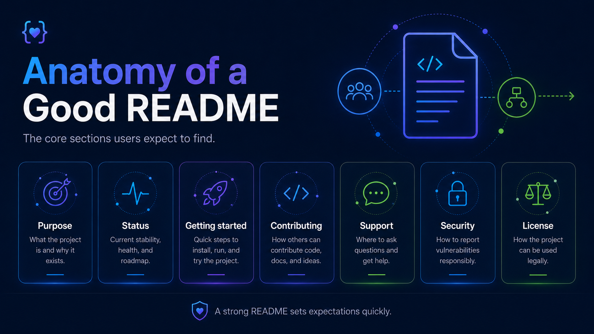

# Repository README Template

Use this template as a baseline. Remove sections that genuinely do not apply rather than leaving empty headings.



## Project Name

One or two sentences explaining what the project is and why it exists.

### Status

**Status:** Active | Community-supported | Experimental | Maintenance-only | Deprecated

**Support:** Officially supported | Community-supported | Experimental

Add the applicable support disclaimer.

### Overview

Explain:

- What the project does.
- Who it is intended for.
- The problem it solves.
- Its relationship to Dynatrace where relevant.

## Getting started

## Prerequisites

List required:

- Software.
- Accounts.
- Runtime versions.
- Permissions.
- Infrastructure.

## Installation

```shell
# installation example
```

## Basic usage

```shell
# basic usage example
```

## Documentation

Link to detailed documentation if it exists outside the repository.

## Support

Describe the support model.

For officially supported projects:

> For product support, use the applicable Dynatrace support channel. GitHub Issues may be used for repository-specific bugs, feature requests, or contribution discussions.

For community-supported projects:

> This project is community-supported and is not covered by standard Dynatrace product support. Support is provided on a best-effort basis.

## Contributing

Contributions are welcome.

See `CONTRIBUTING.md`.

If contributions are not currently accepted, state that clearly instead.

## Security

Do not report security vulnerabilities through public GitHub Issues.

See `SECURITY.md`.

## Maintainers

Maintained by:

- `@team-or-maintainer`

Prefer team ownership where possible.

## License

Licensed under the terms described in `LICENSE`.
