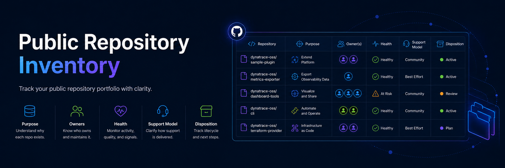

# Dynatrace Public Repository Inventory

This inventory provides a structured assessment of public repositories across Dynatrace GitHub organizations.

## Organizations

### [Dynatrace](./dynatrace/)

Public repositories associated with Dynatrace product delivery, integrations, SDKs, examples, tooling, and other company-owned open source projects.

### [dynatrace-oss](./dynatrace-oss/)

Public repositories focused on community-supported open source projects, ecosystem tooling, experimentation, and broader external collaboration.

## Repository classifications

Repositories are assessed using the following lifecycle classifications:

- **Strategic**
- **Active / Community-Supported**
- **Experimental**
- **Maintenance-Only**
- **Archive Candidate**
- **Transfer or Deletion Candidate**

Classification describes the repository's current role and health. It does not independently determine whether a repository should be moved, archived, transferred, or deleted.

## Assessment areas

Repository reviews may consider:

- Business and ecosystem purpose.
- Strategic relevance.
- Owning team.
- Named maintainers.
- Support model.
- Activity level.
- Documentation status.
- License status.
- Security readiness.
- Dependencies and automation.
- OpenSSF Scorecard signals.
- Recommended lifecycle disposition.

## Inventory status

This inventory is a governance and planning resource.

Repository information should be reviewed periodically because ownership, activity, support status, security posture, and strategic relevance can change over time.

Automated metrics and estimated security scores should be treated as signals for review rather than definitive assessments.
